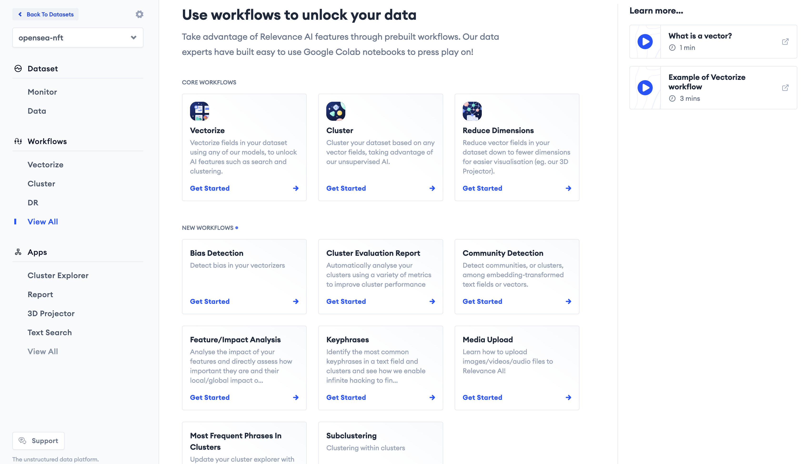

[](https://relevanceai.readthedocs.io/en/latest/?badge=latest)
[](https://img.shields.io/pypi/l/relevanceai)

[Join our slack channel!](https://join.slack.com/t/relevance-ai/shared_invite/zt-11fo8oush-dHPd57wamhoQ7J5arNv1mg)

**Run Our Colab Notebook And Get Started In Less Than 10 Lines Of Code!**

[](https://github.com/RelevanceAI/workflows/blob/main/workflows/quickstart_workflow/%E2%98%98%EF%B8%8F_Relevance_AI_Quickstart.ipynb)

For guides and tutorials on how to use this package, visit https://docs.relevance.ai/docs.

## 🔥 Workflows by Relevance AI



This is a home for all of RelevanceAI's workflows as seen in the [dashboard](https://hubs.ly/Q017CkXK0). Sign up and getting started [here](https://hubs.ly/Q017CkXK0)!


Workflows provide users with a guide on how to run relevant code in Relevance AI.
It provides a guided interface through Relevance AI Features.

Some of these features include:

- Clustering
- Dimensionality Reduction
- Labelling/Tagging
- Launching Projectors

# How to add a workflow

How to add a workflow

1) Add a subfolder and move notebook there and push the notebook
2) Modify scripts/manual_add_to_db.py and add a new document in the `DOCS` variable and commit/push the script. Make sure to see what the other documents are doing and copy that structure else things may error!
3) Create PR

## 🔥 Features

- Fast vector search with free dashboard to preview and visualise results
- Vector clustering with support for libraries like scikit-learn and easy built-in customisation
- Store nested documents with support for multiple vectors and metadata in one object
- Multi-vector search with filtering, facets, weighting
- Hybrid search with support for weighting keyword matching and vector search
... and more!


## 🚧 Development

## 🛠️  Requirements

- [Python ^3.7.0](https://www.python.org/downloads/release/python-3713/)
- [AWS CLI v2](https://docs.aws.amazon.com/cli/latest/userguide/getting-started-install.html) - if you need to upload new workflows to prod


### Getting Started
To get started with development, install the dev dependencies

```zsh
❯ make install
```

### Uploading workflows

Make sure your AWS SSO profile and creds configured in [`~/.aws/config`](https://docs.aws.amazon.com/cli/latest/userguide/cli-configure-sso.html).

Install [`yawsso`](https://github.com/victorskl/yawsso) or similar to sync API creds w/ SSO profile needed for CDK.
Set the `AWS_PROFILE` env var to bypass having to specify `--profile` on every AWS CLI call.

```zsh
❯ make update
```

### Testing


Then run testing using:

> Don't forget to set your test credentials!

```zsh
export TEST_ACTIVATION_TOKEN=<YOUR_ACTIVATION_TOKEN>

## For testing core workflows
export WORKFLOW_TOKEN_CLUSTER_YOUR_DATA_WITH_RELEVANCE_AI=<DASHBOARD_BASE64_TOKEN_FROM_CLUSTER_WORKFLOW>
export WORKFLOW_TOKEN_VECTORIZE_YOUR_DATA_WITH_RELEVANCE_AI=<DASHBOARD_BASE64_TOKEN_FROM_VECTORIZE_WORKFLOW>
export WORKFLOW_TOKEN_REDUCE_THE_DIMENSIONS_OF_YOUR_DATA_WITH_RELEVANCE_AI=<DASHBOARD_BASE64_TOKEN_FROM_DR_WORKFLOW>
export WORKFLOW_TOKEN_CORE_SUBCLUSTERING<DASHBOARD_BASE64_TOKEN_FROM_SUBCLUSTERING_WORKFLOW>
```

Run test script

- tests all notebooks in `workflows`
- outputs error `notebook_error.log`


```zsh
❯ python scripts/test_notebooks.py

## Testing indiv notebook
❯ python scripts/test_notebooks.py --notebooks subclustering/core_subclustering.ipynb
```


## More Helpful Commands

```zsh
❯ make help
Available rules:

clean               Delete all compiled Python files
install             Install dependencies
lint                Lint using flake8
test                Test dependencies
update              Update dependencies
upload              Upload notebooks to S3 and update ds
```
